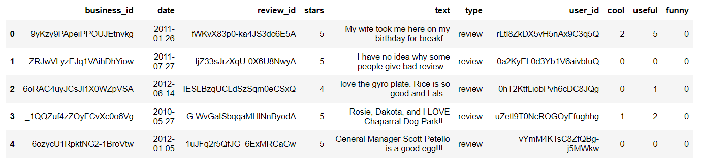
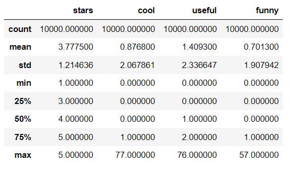
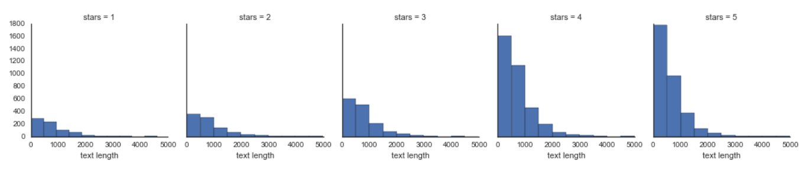
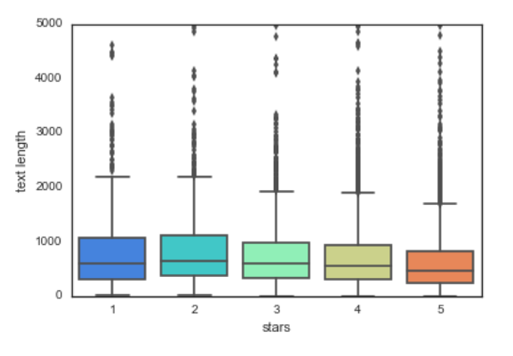
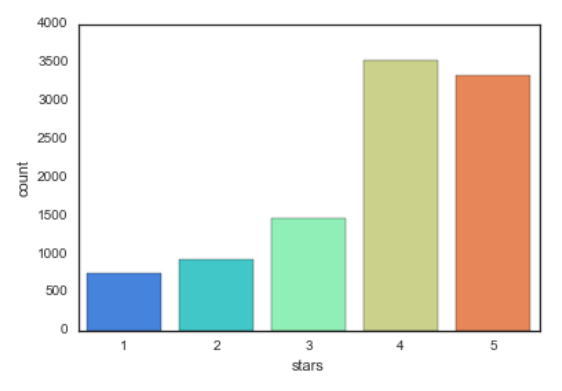
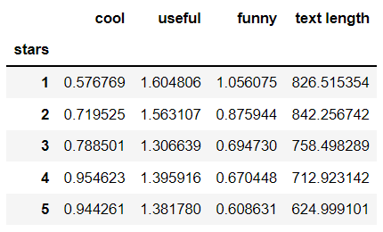
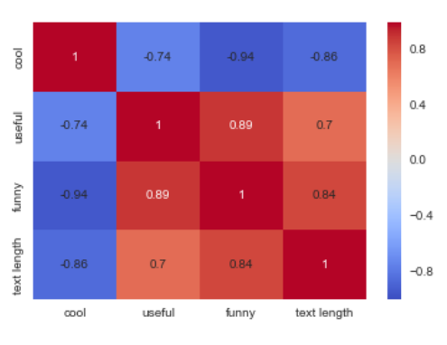
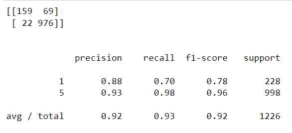
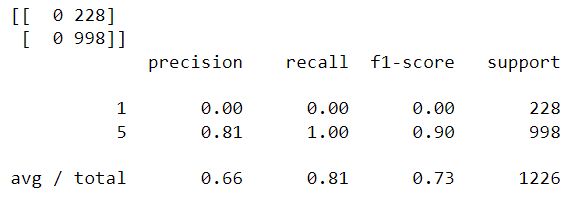

# yelp-star-rating-prediction
Goal: Accurately classify Yelp Reviews into 1 star or 5 star categories based off the text content in the reviews

Data: Yelp Review Data Set from Kaggle (yelp.csv).

Each observation in this dataset is a review of a particular business by a particular user.

The "stars" column is the number of stars (1 through 5) assigned by the reviewer to the business. (Higher stars is better.) In other words, it is the rating of the business by the person who wrote the review.

The "cool" column is the number of "cool" votes this review received from other Yelp users.

All reviews start with 0 "cool" votes, and there is no limit to how many "cool" votes a review can receive. In other words, it is a rating of the review itself, not a rating of the business.

The "useful" and "funny" columns are similar to the "cool" column.

# Data

Get descriptive statistics for data

# Exploratory Data Analysis
Histogram: Text length based on star review

Boxplot: Text length based on star review

Number of occurrences for each type of star rating

Mean values grouped by star rating

# Model evaluation
Confusion matrix and classification report

Model performed well. Will including TF-IDF (statistical measure that evaluates how relevant a word is to a document in a collection of documents) in this process using SciKit Learn's pipeline improve the model?

# Text Processing: using Term Frequency-Inverse Document Frequency (TF-IDF)
Confusion matrix and classification report after using SciKit Learn's pipeline

Tf-Idf worsened model based on evaluation metrics.
